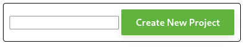
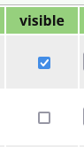
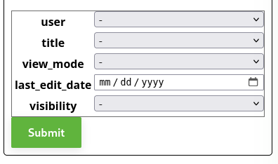
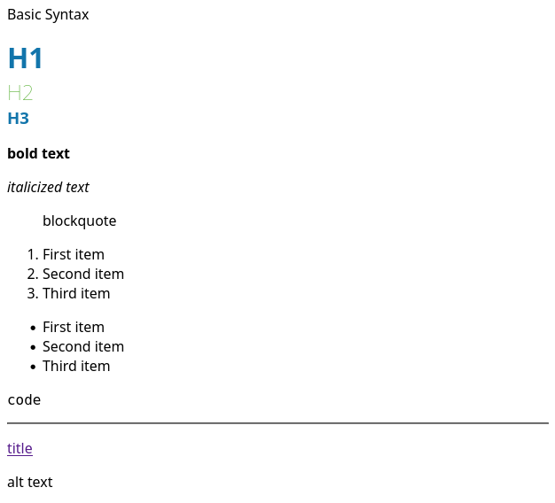
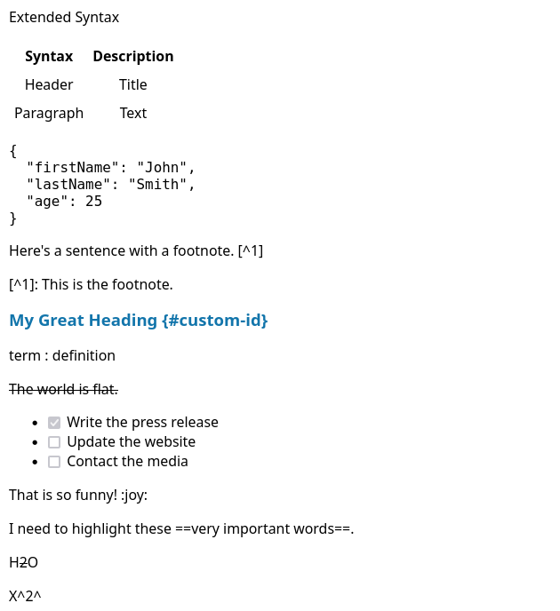

# ScaDS poster generator (tbd)


Idea is to have a centralized poster generator, which allows visual editing of
scientific poster with LaTeX, images, lists and so on (almost full markdown support).

# Setup
To setup the container environment, you have to run the folowing command:
```console
bash docker.sh --local-port 1112
```
The ```--local-port``` parameter indicates which network port the server is using. This parameter is strictly required for the setup command to work.

If you want to know if everything is setup correctly, optionally you can use:
```console
bash docker.sh --local-port 1112 --run-tests
```

# Index-Page
For a poster to be shown on the index-page, two requrments need to be meed:
1. The poster needs to be set from ```private``` to ```public``` *(by admin, user)*
2. The poster needs to be set to ```visible = true```, using the checkbox *(only by admin)*

# Projects-Page
The projects-page is the page where all the posters are listed.
There exists the following three tables:
- Posters
- Authors
- Images

To create a new Poster the user has to fill out the form with a new name and click on the ```[Create New Project]``` button.

New Authors and Images are automaticaly added to the tables when they are included on the Poster-Page.
Those tables can be used to manage e.g. excessive data.

The Admin hase some additional privileges to manage all existing Posters.

## Admin-User
For the public poster to be depicted on the index-page the admin is requred to set the poster to visible (tick the checkbox).


The Admin has access to all posters and can modify them.
On default all available posters will be shown on the Projects-Page. To limit the number of posters shown or to serach for a specific group of posters, the admin can use the filter menu:


# Poster-Page
The poster-page constists of the following elements:

Title
: The Poster Title, describes how the poster is named. Can be edited and supports Markdown and LaTeX *(see below)*.

Authors
: The Authors of the poster, to add a new author write in the textfield and deselect the textfield.
If authors are already added, they will be shown in the autocomplete options.
To remove an author, hover on the author element and click on the ```[X]``` button.
The author order can be changed via drag and drop.

view_mode
: Can be ```private```*(default)* or ```public```. If on ```private``` poster con not be shown on index-page.

Boxes (Text fields)
: Contain the actual text content of the poster.
To add a new Box, click on the ```[Add Box]``` button.
To remove a Box remove all text from the Box and deselect the textfield.
To edit a Box, click on the Box, the user can now edit the textfield, deselect said textfield afterwards. The poster-boxes support Markdown and LaTeX redering *(see below)* and file uploads *(see below)*.

## Using Markdown
<!--  -->
<!--  -->

Using [this Cheatsheet](https://www.markdownguide.org/cheat-sheet/) as a comparison.
Markdown features that are not supported (yet):
- Blockquote: ```> blockquote```
- Code: `code`
- Image: `````` *(see image upload)*
- Table
- Fenced Code Block
- Footnote
- Heading ID
- Definition List
- Emoji
- Highlight
- Subscript
- Superscript

## Using LaTeX
TBD

## Upload
To upload, hover over the Box you want add content to and click on the [```Browse...```] button. Now select your file. Now the content of your file should be inside a placeholder, you can click outside of your selected Box.

Now, the text with the placeholder should disappear and the content should be correctly redered.
If not please check if the file content has the correct formating.

### Image-Upload
The user can upload several types of content into a box. For images the supported file types are:
- ```png```
- ```jpg```
- ```gif```

Once uploaded, the Box will automatically display a placeholde,
something like: ```<p placeholder="image">includegraphics{name.png}</p>```. You can arrange this line in your Text Box however you like.
To remove the image, simply delete the placeholder line. All images will be stored in cache. To view them, navigate to the Projects-page manage them.
To restore your removed image, include the before mentioned placeholderline. Make sure you are using the correct file name of your image.

### Chart-Upload
Additionally the user can upload charts of the following file types:
- ```csv``` (for rendering simple charts)
After uploading the file it should look something like this:
```console
<p placeholder="plotly" chart="scatter">
x,y
1,2
3,2
3,6
0,3
-2,4
3,3
</p>
```
Valid chart types are: ```scatter```, ```line```, ```bar```, ```pie```
To modify the chart type, replace the chart type with one of the other types e.g.: ```chart="bar"```

- ```json``` (for rendering more complex charts, high customization potential; see path: ```/plotly/examples/*.json```, For some reason some won't work Issue: #203; #204)
